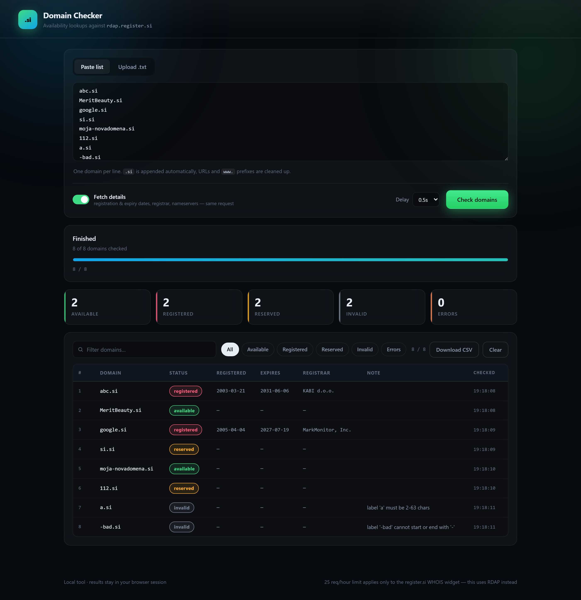

# si-domain-checker

Check whether **`.si`** domains are **available**, **registered** or **reserved** — through a web UI or the command line. Powered by the public RDAP service at `rdap.register.si`.



## Statuses

| status | meaning | source |
|---|---|---|
| `available` | free to register | RDAP `404` |
| `registered` | taken | RDAP `200` |
| `reserved` | reserved / not registrable (e.g. `112.si`, `si.si`) | RDAP `403` |
| `invalid` | breaks `.si` syntax rules — rejected locally, **no request sent** | local check |
| `error` | network/server failure after retries | — |

## Web UI

```bash
python app.py          # → http://127.0.0.1:5000
```

- **Paste list** or **upload a `.txt`** (click or drag-and-drop)
- Live progress bar, throughput and per-status counters
- Filter chips (available / registered / reserved / invalid / errors) + instant search
- **Download CSV exports exactly what is on screen** — if the *available* filter is active you get only the available rows, and the filename says so (`domains-si-available.csv`)
- **Fetch details** toggle adds registration date, expiry, registrar and nameservers — from the *same* request, so it costs nothing extra
- Stop mid-run, clear, adjustable delay

## Input format

One domain per line:

```text
# my candidate list
abc.si
MeritBeauty.si
moja-domena
https://www.some-site.si/path
```

- Lines starting with `#` and blank lines are ignored
- `.si` is appended automatically when missing
- Schemes, paths and query strings are stripped
- Duplicates (case-insensitive) are removed before checking

## CLI

Reads a CSV, updates it in place and resumes where it left off:

```bash
python check_domains.py domains.csv                 # skip rows that already have a status
python check_domains.py domains.csv --details       # + dates, registrar, nameservers
python check_domains.py domains.csv --recheck       # recheck everything
python check_domains.py domains.csv --delay 0.2 --quiet
```

`domains.csv` only needs a `domain` column; `status`, `checked_at`, `note` (and with `--details`, `registered`, `expires`, `registrar`, `nameservers`) are added automatically. The file is rewritten after every lookup, so Ctrl+C loses at most one result.

## Why RDAP instead of the WHOIS widget

The WHOIS search box on `www.register.si` posts to `wp-admin/admin-ajax.php` with `action=get_domain_status` / `get_whois_data`. It is hard-limited to **25 requests per hour per IP** — exceeding it returns:

```json
{"errType":3,"errMessage":"Too many requests (25) from this IP ..."}
```

and the UI tells you to wait one hour.

`https://rdap.register.si/domain/<name>` is the registry's public RDAP endpoint: no auth, no hourly cap (160 requests verified in 90 seconds), and it returns structured JSON with dates and nameservers in a single call.

### `.si` syntax rules (checked before any request)

- label length 2–63 characters
- no leading or trailing `-`
- no `--` at positions 3–4
- letters (Latin incl. `č`, `š`, `ž`), digits and `-` only

## Requirements

- **Python 3.9+**
- **Flask 2.0 or newer** — the API uses the `@app.get` / `@app.post` shorthand (added in 2.0)
- `requests`

```bash
pip install "flask>=2.0" requests
```

## Tests

Both scripts start their own server on a private port and shut it down
afterwards, so nothing has to be running first:

```bash
python smoke_test.py   # API: start / poll / export / error paths
python test_ui.py      # browser: filters + CSV contents (extra dep below)
```

`test_ui.py` additionally needs Playwright with a browser installed:

```bash
pip install playwright
playwright install chromium
```
